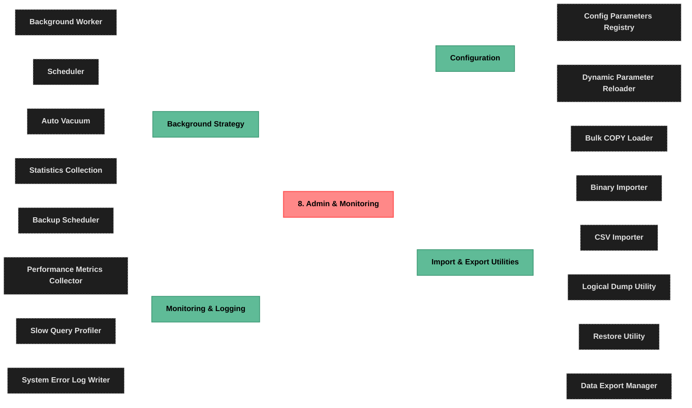

```mermaid
graph LR
    %% Styles cho nền tối (GitHub Dark Mode)
    classDef default fill:#2d2d2d,stroke:#888,stroke-width:1px,color:#fff;
    classDef root fill:#ff8888,stroke:#ff5555,stroke-width:2px,font-weight:bold,color:#000;
    classDef layer2 fill:#5fbb97,stroke:#3a9672,stroke-width:1.5px,font-weight:bold,color:#000;
    classDef layer3 fill:#1e1e1e,stroke:#aaaaaa,stroke-width:1px,stroke-dasharray: 3 3,color:#e0e0e0;

    %% Tăng độ tương phản cho đường nối liên kết giữa các node
    linkStyle default stroke:#ffffff,stroke-width:1.5px;

    %% Nút gốc (Center)
    am[8. Admin & Monitoring]:::root

    %% NỬA BÊN TRÁI
    am_bs[Background Strategy]:::layer2 --- am
    am_bs1[Background Worker]:::layer3 --- am_bs
    am_bs2[Scheduler]:::layer3 --- am_bs
    am_bs3[Auto Vacuum]:::layer3 --- am_bs
    am_bs4[Statistics Collection]:::layer3 --- am_bs
    am_bs5[Backup Scheduler]:::layer3 --- am_bs

    am_ml[Monitoring & Logging]:::layer2 --- am
    am_ml1[Performance Metrics Collector]:::layer3 --- am_ml
    am_ml2[Slow Query Profiler]:::layer3 --- am_ml
    am_ml3[System Error Log Writer]:::layer3 --- am_ml

    %% NỬA BÊN PHẢI
    am --- am_cm[Configuration]:::layer2
    am_cm --- am_cm1[Config Parameters Registry]:::layer3
    am_cm --- am_cm2[Dynamic Parameter Reloader]:::layer3

    am --- am_ie[Import & Export Utilities]:::layer2
    am_ie --- am_ie1[Bulk COPY Loader]:::layer3
    am_ie --- am_ie2[Binary Importer]:::layer3
    am_ie --- am_ie3[CSV Importer]:::layer3
    am_ie --- am_ie4[Logical Dump Utility]:::layer3
    am_ie --- am_ie5[Restore Utility]:::layer3
    am_ie --- am_ie6[Data Export Manager]:::layer3
```
